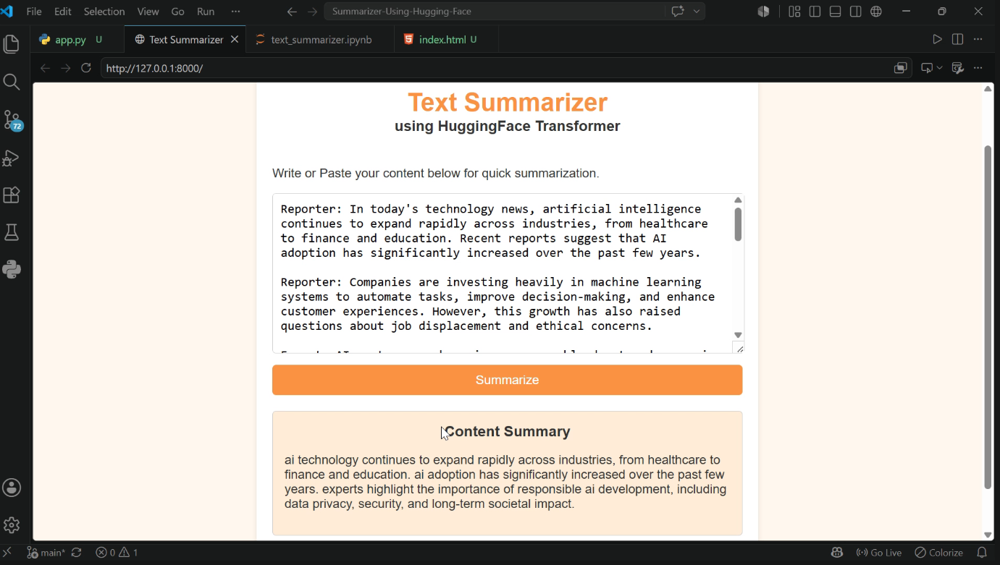

# 📝 Summarizer Using Hugging Face

An AI-powered text summarization application that generates concise summaries from long conversations using a fine-tuned **T5-small Transformer** model. The application provides a simple web interface built with **FastAPI** where users can paste lengthy dialogues and receive meaningful summaries in seconds.

---

## 🚀 Features

- Fine-tuned **T5-small** model for dialogue summarization
- FastAPI backend for inference
- Simple HTML/CSS frontend
- Text preprocessing using Regular Expressions
- Beam Search decoding for better summaries
- GPU (CUDA) support for faster inference
- Clean and responsive user interface

---

## 🛠️ Tech Stack

- Python
- FastAPI
- Hugging Face Transformers
- PyTorch
- HTML
- CSS
- JavaScript
- Jinja2
- SentencePiece

---

## 🧠 Model Information

| Property | Value |
|----------|-------|
| Model | T5-small |
| Task | Dialogue Summarization |
| Dataset | SAMSum |
| Framework | Hugging Face Transformers |
| Backend | FastAPI |
| Inference | Beam Search |

---

## 📂 Project Structure

```
Summarizer-Using-Hugging-Face/
│
├── app.py
├── index.html
├── text_summarizer.ipynb
├── requirements.txt
├── .gitignore
└── README.md
```

---

## ⚙️ Installation

Clone the repository

```bash
git clone <repository-url>
```

Move into the project

```bash
cd Summarizer-Using-Hugging-Face
```

Install dependencies

```bash
pip install -r requirements.txt
```

Run the FastAPI server

```bash
python -m uvicorn app:app
```

Open your browser

```
http://127.0.0.1:8000
```

---

## 📊 Dataset

The model is fine-tuned using the **SAMSum Dataset**, which contains real-world conversations between people and corresponding human-written summaries.

---

## 💻 Workflow

```
User Input
      │
      ▼
Text Cleaning
      │
      ▼
Tokenization
      │
      ▼
Fine-tuned T5-small
      │
      ▼
Summary Generation
      │
      ▼
Decoded Summary
      │
      ▼
Frontend Output
```

---

## 📸 Application Preview

> Add screenshots here after deployment.

---

## 📈 Future Improvements

- PDF summarization
- Document summarization
- Adjustable summary length
- User authentication
- Docker deployment
- Cloud deployment
- REST API documentation

---

## 👨‍💻 Author

**Aakash Sambhaji Thakare**

Artificial Intelligence & Data Science Engineering Student

---

⭐ If you found this project useful, consider giving it a star.

---

### 📄 Generated Summary


